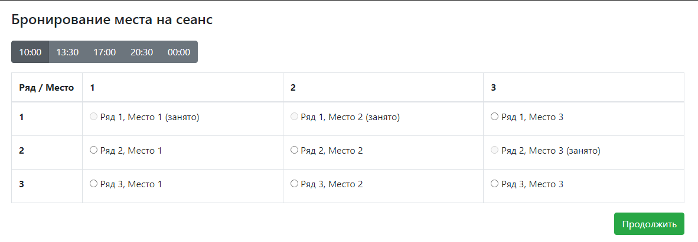
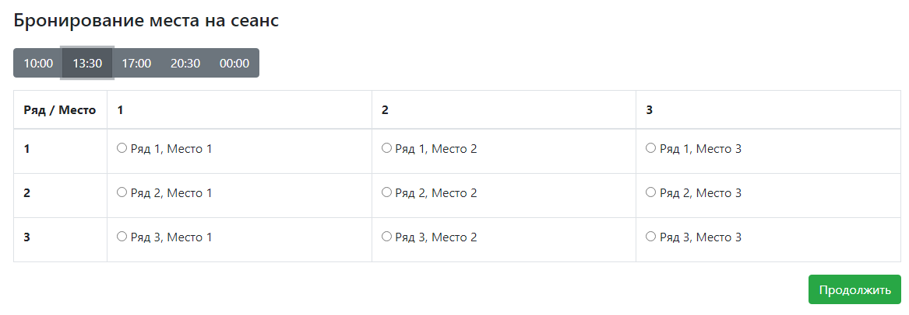
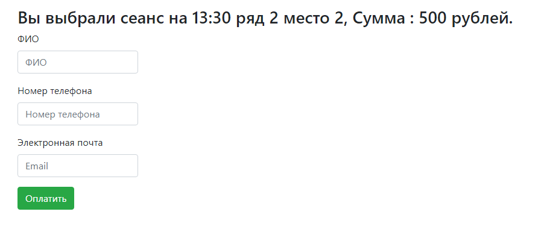

# job4j_cinema

### Описание:

Это простое веб-приложение, которое позволяет бронировать места для сеансов в кинотеатре.

### Технологии, используемые в проекте:

+ Сборщик проектов **Maven**;
+ Непрерывная интеграция - **Travis CI**;
+ Frontend - **JavaScript**;
+ Backend - **Java**:
  + **JDBC**;
  + **Servlet**;
  + Логгирование - **Log4j** и **Slf4j**;
+ Используемая СУБД - **PostgreSQL**;
+ Инструмент для анализа стиля кода - **Checkstyle**;

---

Основная страница:

В верхней части страницы находится переключатель между сеансами. По центру - все места в зале. Ниже - кнопка 
"Продолжить", которая перенаправляет нас на страницу брони. Для бронирования места необходимо выбрать свободное место и
непосредственно кликнуть на кнопку "Продолжить". Забронированные места невозможно выбрать. А также рядом с ними 
добавлена текстовая подсказка (занято)

---

Если переключиться с помощью верхней панели, то данные зала динамически обновятся с сервера:

--- 

На странице брони имеются маски для телефона и электронной почты. Страница после выбора места и сеанса:

---

При попытке "Оплатить" без заполненных полей, будет выдано предупреждение:

---

Если кто-то быстрее нас забронировал выбранное нами место, то при попытке "Оплатить", будет выдано уведомление:

---

При удачной брони будет выдано уведомление и нас перекинет на главную страницу:

