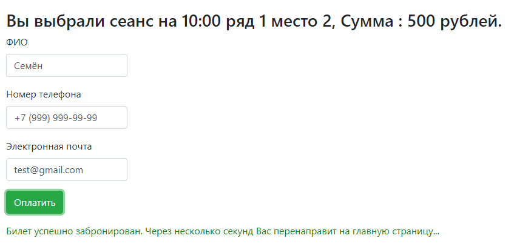

# job4j_cinema

+ [О проекте](#О-проекте)
+ [Технологии](#технологии)
+ [Интерфейс](#интерфейс)
+ [Контакты](#контакты)

## О проекте

Это простое MVC веб-приложение на сервлетах и JDBC, которое позволяет бронировать места для сеансов в кинотеатре.

## Технологии

+ Сборщик проектов **Maven**;
+ Frontend - **HTML**, **CSS**, **BOOTSTRAP**, **JS**, **AJAX**, **JQUERY**;
+ Backend - **Java 14**, **JDBC**, **Servlet**;
+ Логгирование - **Log4j**, **Slf4j**;
+ Используемая СУБД - **PostgreSQL**;
+ Контейнер сервлетов - **Apache Tomcat**;
+ Непрерывная интеграция - **Travis CI**;
+ Инструмент для анализа стиля кода - **Checkstyle**;

## Интерфейс

Основная страница:

В верхней части страницы находится переключатель между сеансами. По центру - все места в зале. Ниже - кнопка 
"Продолжить", которая перенаправляет нас на страницу брони. Для бронирования места необходимо выбрать свободное место и
непосредственно кликнуть на кнопку "Продолжить". Забронированные места невозможно выбрать. А также рядом с ними 
добавлена текстовая подсказка (занято)

---

Если переключиться с помощью верхней панели, то данные зала динамически обновятся с сервера:

--- 

На странице брони имеются маски для телефона и электронной почты. Страница после выбора места и сеанса:

---

При попытке "Оплатить" без заполненных полей, будет выдано предупреждение:

---

Если кто-то быстрее нас забронировал выбранное нами место, то при попытке "Оплатить", будет выдано уведомление:

---

При удачной брони будет выдано уведомление и нас перекинет на главную страницу:

## Контакты

Становов Семён Сергеевич

Email: sestanovov@gmail.com

Telegram: [@stanovovss](https://t.me/stanovovss)